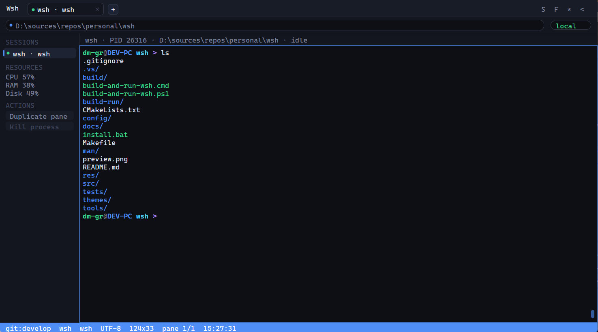
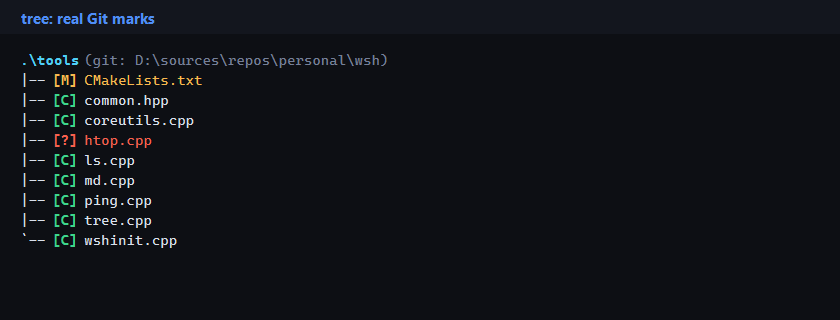
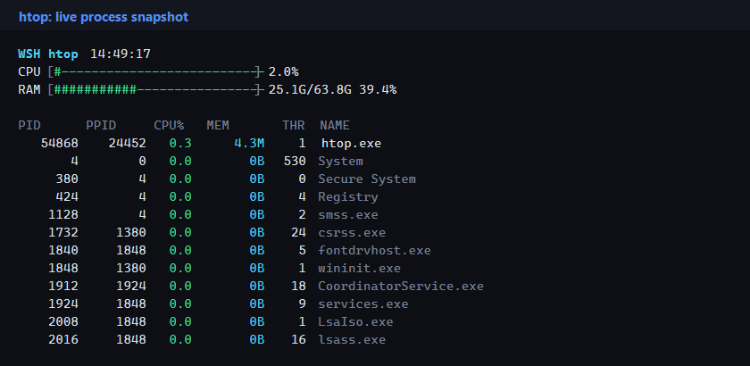
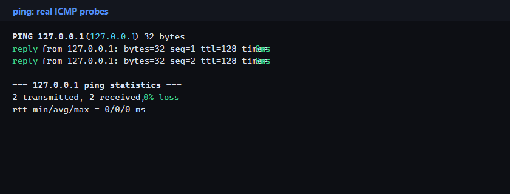

# Wsh

Wsh is a Windows-first shell and terminal environment written in C/C++ with CMake, Win32, Direct2D/DirectWrite, and ConPTY.

The project combines a real terminal host, a built-in shell runtime, split panes, VT/ANSI rendering, scrollback, bundled Unix-like utilities, local manual pages, themes, and a compact Material Cyber UI.

## Screenshots

The screenshots below are generated from real Wsh bundle utilities and repository state. They do not use demo sessions or hardcoded output.









## Current State

Implemented now:

- Native Win32 window and message loop.
- NeoTerm-inspired Material Cyber terminal layout with tabs, toolbar, sidebar, terminal header, viewport, and status bar.
- Direct2D/DirectWrite terminal renderer.
- Terminal screen buffer, VT parser, cursor rendering, selection, resize, alternate screen, and scrollback.
- Split panes and active pane routing.
- Built-in shell context, lexer, parser, executor, history, jobs, and completion.
- Optional external shell hosting through ConPTY.
- Config loading from `%APPDATA%\Wsh\Wsh.toml`.
- Built-in `help` and `man` commands.
- Runtime logging under `%LOCALAPPDATA%\Wsh\logs\wsh.log`.
- Built-in themes and bundled manual pages.
- Companion utilities copied into the runtime bundle.
- CTest-based tests for shell, terminal, utility, and UI state behavior.

Still not honest to claim as complete:

- Full Zsh compatibility.
- Full oh-my-zsh plugin compatibility.
- Mature package/plugin manager.
- Complete shell integration for every external shell.
- Production-grade parser diagnostics and config validation.

## Build And Run

The easiest local workflow is the project script:

```powershell
pwsh -NoProfile -ExecutionPolicy Bypass -File .\build-and-run-wsh.ps1 -NoRun -RunTests
```

This configures, builds, copies runtime assets, and runs the test suite. Runnable output is placed into:

```text
build-run\dist
```

Launch Wsh:

```powershell
.\build-run\dist\Wsh.exe
```

Manual CMake flow:

```powershell
cmake -S . -B build -DCMAKE_BUILD_TYPE=Release
cmake --build build --config Release
ctest --test-dir build --output-on-failure
```

## First Run

Initialize the user environment:

```powershell
.\build-run\dist\wshinit.exe
```

This creates:

```text
%APPDATA%\Wsh\Wsh.toml
%APPDATA%\Wsh\themes\
%APPDATA%\Wsh\man\
```

Inside Wsh:

```sh
help
man wsh
man tree
man ping
man htop
tree -L 2 .
ping -n 4 127.0.0.1
htop -n 20 -s mem
```

## UI

The main window is organized as:

- Title area with native Windows controls.
- Real terminal tab strip.
- Toolbar with active path and session badge.
- Optional sidebar with real sessions, resources, and actions.
- Terminal header with active shell, PID, path, and state.
- Terminal viewport backed by the real renderer and screen buffer.
- Blue status bar with runtime state such as Git branch, folder, shell, encoding, size, pane index, and time.

The UI intentionally avoids fake data. Values shown in tabs, path bars, status badges, resource meters, and utility output come from active Wsh/session/system state. Unsupported data is hidden or shown as unavailable rather than invented.

## Companion Utilities

Bundled utilities include:

- Files and directories: `ls`, `tree`, `cat`, `pwd`, `cp`, `mv`, `rm`, `mkdir`, `rmdir`, `touch`
- Text processing: `head`, `tail`, `wc`, `grep`, `sort`, `uniq`, `cut`, `tee`
- Path lookup: `basename`, `dirname`, `which`
- System and shell helpers: `whoami`, `hostname`, `uname`, `date`, `clear`, `sleep`, `yes`, `true`, `false`, `echo`, `env`, `printenv`
- Viewing and search: `more`, `less`, `find`
- Windows-friendly helpers: `md`, `wshinit`
- Network and monitoring: `ping`, `htop`

`tree` displays real filesystem data, colorizes folders/files, and marks Git state when available:

- `[C]` tracked and clean
- `[M]` modified
- `[?]` untracked
- `[A]`, `[D]`, `[R]`, `[U]` for added, deleted, renamed, and conflicted states

`ping` uses real ICMP requests on Windows and includes structured, colored output with latency and packet statistics.

`htop` shows a real process snapshot with PID, CPU, memory, working set, and process name. It supports sorting, row limits, refresh interval, watch mode, and ANSI color control.

## Configuration

Main config:

```text
%APPDATA%\Wsh\Wsh.toml
```

Example:

```toml
[general]
shell = "wsh"
scrollback = 10000
confirm_exit = true
bell = "visual"
default_cwd = "~"
theme = "material-cyber-dark"
title = "Wsh - ${cwd}"
```

`general.shell = "wsh"` uses the built-in shell. Any other command path is hosted through ConPTY.

Title placeholders:

- `${cwd}` - current working directory.
- `${theme}` - configured theme name.
- `${version}` - Wsh version.

## Themes

Theme files are TOML files with a `[colors]` section.

Search order:

1. `dist\themes\<theme>.toml`
2. `%APPDATA%\Wsh\themes\<theme>.toml`
3. Direct path if `general.theme` contains a slash, backslash, or drive separator.

Built-in themes include:

- `material-cyber-dark`
- `catppuccin-mocha`
- `nord`
- `solarized-dark`
- `material-ocean`
- `wsh-light`

## Repository Map

- `src/core` - strings, paths, arena, logging.
- `src/shell` - lexer, parser, executor, builtins, history, jobs, completion.
- `src/terminal` - screen, VT parser, renderer, font, scrollback.
- `src/platform` - config, ConPTY, input translation.
- `src/main.cpp`, `src/window.cpp`, `src/repl.c` - app wiring and UI loop.
- `tools` - companion utilities.
- `themes` - built-in themes.
- `man` - bundled manual pages.
- `tests` - unit tests.
- `docs/screenshots` - README screenshots generated from real bundle output.
- `docs/REFACTORING_PLAN.md` - planned evolution into a complete console environment.

## Error Logging

Wsh writes runtime diagnostics and crash details to:

```text
%LOCALAPPDATA%\Wsh\logs\wsh.log
```

If `LOCALAPPDATA` is unavailable, Wsh falls back to `logs\wsh.log` near the executable. The log file is capped at 10 MiB. When the next write would exceed the cap, the file is truncated and logging continues from the beginning.

Logged events include startup/shutdown, Win32 API failures, PTY errors, renderer/font initialization failures, unhandled C++ exceptions, CRT invalid-parameter failures, process signals, and unhandled structured exceptions.
