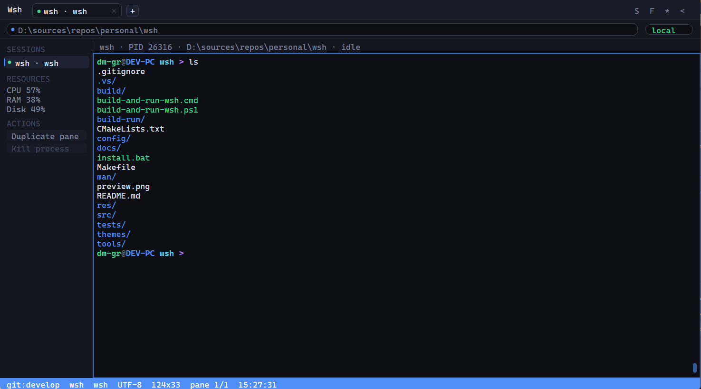
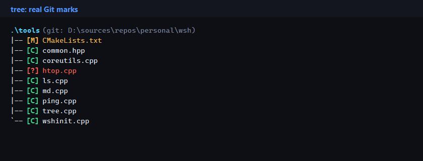
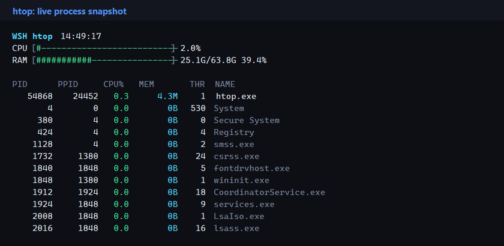
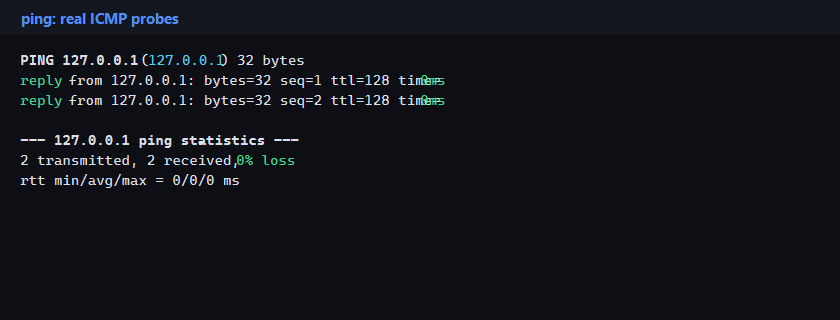

# Wsh

Wsh is a Windows-first shell and terminal environment written in C/C++ with CMake, Win32, Direct2D/DirectWrite, and ConPTY.

The project combines a real terminal host, a modular ZSH-compatible shell runtime, split panes, VT/ANSI rendering, scrollback, bundled Unix-like utilities, local manual pages, themes, session save/restore, and a Material Cyber UI.

**Build**: 51 targets, zero errors — **Tests**: 60/60 passing (100%)

## Screenshots

The screenshots below are generated from real Wsh bundle utilities and repository state. They do not use demo sessions or hardcoded output.









## Current State

Implemented now:

- Native Win32 window and message loop.
- NeoTerm-inspired Material Cyber terminal layout with tabs, toolbar, sidebar, terminal header, viewport, and status bar.
- Direct2D/DirectWrite terminal renderer with 256-color palette, truecolor, bold/italic/underline/blink/reverse/strikethrough, CJK double-width.
- Terminal screen buffer, VT/ANSI escape sequence parser, cursor rendering, selection, resize, alternate screen, and scrollback (configurable, default 10K).
- Split panes (1–4) and active pane routing.
- Modular ZSH-compatible built-in shell — lexer, parser, executor, 48 built-in commands, history (ring buffer, 50K max, reverse search, file persistence), jobs (64 max, fg/bg/kill), completion, variable expansion, globbing, brace expansion, arithmetic, command substitution, heredocs, pipelines, if/while/for/function/case, `precmd`/`preexec` hooks.
- Optional external shell hosting through ConPTY (cmd.exe, PowerShell, WSL, etc.).
- Config loading from `%APPDATA%\Wsh\Wsh.toml` with sections for general, font, cursor, colors, keybinds, tabs, scrollbar, and session.
- Built-in `help`, `man`, and `history` commands with 42 bundled manual pages.
- In-shell task scheduler — one-shot and repeating delayed commands (`at`/`atq`/`atrm`).
- Session persistence — save and restore tabs, panes, scrollback, and cursor state across restarts.
- Runtime logging under `%LOCALAPPDATA%\Wsh\logs\wsh.log` (10 MiB cap, auto-truncate).
- Built-in themes (6) and companion utilities (8 binaries providing 35+ commands).
- CTest-based tests for shell, terminal, utility, and UI state behavior.
- GitHub Actions CI/CD — automatic release builds, packaging, and publishing on tagged commits.
- PowerShell and batch installers with App Paths registration, Explorer context menus, PATH setup, and desktop shortcuts.

Still not honest to claim as complete:

- Full Zsh compatibility.
- Full oh-my-zsh plugin compatibility.
- Mature package/plugin manager.
- Complete shell integration for every external shell.
- Production-grade parser diagnostics and config validation.

## Build And Run

The easiest local workflow is the project script:

```powershell
pwsh -NoProfile -ExecutionPolicy Bypass -File .\build-and-run-wsh.ps1 -NoRun -RunTests
```

This configures, builds, copies runtime assets, and runs the test suite. Runnable output is placed into:

```text
build-run\dist
```

Launch Wsh:

```powershell
.\build-run\dist\Wsh.exe
```

Manual CMake flow:

```powershell
cmake -S . -B build -DCMAKE_BUILD_TYPE=Release
cmake --build build --config Release
ctest --test-dir build --output-on-failure
```

Build options:

| Option | Description |
|---|---|

## First Run

Initialize the user environment:

```powershell
.\build-run\dist\wshinit.exe
```

This creates:

```text
%APPDATA%\Wsh\Wsh.toml
%APPDATA%\Wsh\themes\
%APPDATA%\Wsh\man\
```

Inside Wsh:

```sh
help
man wsh
man tree
man ping
man htop
tree -L 2 .
ping -n 4 127.0.0.1
htop -n 20 -s mem
```

## Installation

**PowerShell installer** (builds from source, full setup):
```powershell
.\install-wsh.ps1
```

Options: `-NoBuild`, `-NoContextMenu`, `-NoPath`, `-NoShortcut`, `-Clean`, `-Configuration <Debug|Release>`, `-InstallDir <path>`, `-BuildDir <path>`.

**Batch installer** (pre-built binary, lightweight):
```cmd
.\install.bat
```

Both installers register App Paths, add Explorer context menus ("Open in WSH" for folders, drives, and background), optionally add to PATH, and optionally create a desktop shortcut.

## UI

The main window is organized as:

- Title area with native Windows controls.
- Real terminal tab strip (up to 8 tabs).
- Toolbar with active path and session badge.
- Optional sidebar with real sessions, resources, and actions.
- Terminal header with active shell, PID, path, and state.
- Terminal viewport backed by the real renderer and screen buffer.
- Blue status bar with runtime state such as Git branch, folder, shell, encoding, size, pane index, and time.

The UI intentionally avoids fake data. Values shown in tabs, path bars, status badges, resource meters, and utility output come from active Wsh/session/system state. Unsupported data is hidden or shown as unavailable rather than invented.

## Companion Utilities

Bundled utilities are implemented as standalone EXEs — a multi-call `coreutils` binary plus separate dedicated tools:

- **Files and directories**: `ls`, `tree`, `cat`, `pwd`, `cp`, `mv`, `rm`, `mkdir`, `rmdir`, `touch`
- **Text processing**: `head`, `tail`, `wc`, `grep`, `sort`, `uniq`, `cut`, `tee`
- **Path lookup**: `basename`, `dirname`, `which`
- **System and shell helpers**: `whoami`, `hostname`, `uname`, `date`, `clear`, `sleep`, `yes`, `true`, `false`, `echo`, `env`, `printenv`
- **Viewing and search**: `more`, `less`, `find`
- **Windows-friendly helpers**: `md`, `wshinit`
- **Network and monitoring**: `ping`, `htop`

`tree` displays real filesystem data, colorizes folders/files, and marks Git state when available:

- `[C]` tracked and clean
- `[M]` modified
- `[?]` untracked
- `[A]`, `[D]`, `[R]`, `[U]` for added, deleted, renamed, and conflicted states

`ping` uses real ICMP requests on Windows and includes structured, colored output with latency and packet statistics.

`htop` shows a real process snapshot with PID, CPU, memory, working set, and process name. It supports sorting, row limits, refresh interval, watch mode, and ANSI color control.

## Configuration

Main config:

```text
%APPDATA%\Wsh\Wsh.toml
```

Example:

```toml
[general]
shell = "wsh"
scrollback = 10000
confirm_exit = true
bell = "visual"
default_cwd = "~"
theme = "material-cyber-dark"
title = "Wsh - ${cwd}"

[font]
family = "Cascadia Code"
size = 11
ligatures = true

[cursor]
style = "block"
blink = false

[keybinds]
copy = "Ctrl+Shift+C"
paste = "Ctrl+Shift+V"
new_tab = "Ctrl+Shift+T"
close_tab = "Ctrl+Shift+W"

[scrollbar]
visible = true

[session]
auto_save = true

```

`general.shell = "wsh"` uses the built-in shell. Any other command path is hosted through ConPTY.

Title placeholders:

- `${cwd}` — current working directory.
- `${theme}` — configured theme name.
- `${version}` — Wsh version.

Default shell config (`~/.zshrc`):

Bundled as `config/.zshrc` with history settings, aliases (ll, la, .., ...), convenience functions (mkcd, take, extract), and a precmd hook for Git branch display. Supports sourcing a `~/.zshrc.local` override.

## Themes

Theme files are TOML files with a `[colors]` section.

Search order:

1. `dist\themes\<theme>.toml`
2. `%APPDATA%\Wsh\themes\<theme>.toml`
3. Direct path if `general.theme` contains a slash, backslash, or drive separator.

Built-in themes:

- `material-cyber-dark`
- `catppuccin-mocha`
- `nord`
- `solarized-dark`
- `material-ocean`
- `wsh-light`

## Repository Map

- `src/core` — arena allocator, string/path/unicode utilities, structured logger, session serialization.
- `src/shell` — modular ZSH-compatible shell: lexer, parser, executor, 48 builtins, env, expand, history, jobs, completion, scheduler, shell context.
- `src/terminal` — screen buffer, VT/ANSI parser, Direct2D renderer, DirectWrite font, grid layout.
- `src/platform` — TOML config parser, ConPTY lifecycle, Win32 keyboard input translation.
- `src/main.cpp`, `src/window.cpp`, `src/repl.c`, `src/man_viewer.c` — app wiring, window procedure, REPL, and man page viewer.
- `tools` — companion utilities: `coreutils` (multi-call binary, 28 commands), `tree`, `ping`, `htop`, `md`, `wshinit`.
- `themes` — 6 built-in TOML themes.
- `man` — 42 bundled manual pages.
- `config` — default `.zshrc` shell configuration.
- `tests` — 19 unit test files (60 test cases).
- `docs/screenshots` — README screenshots generated from real bundle output.
- `docs/ARCHITECTURE.md` — subsystem mapping and known gaps.
- `docs/REFACTORING_PLAN.md` — planned evolution into a complete console environment.
- `.github/workflows/release.yml` — CI/CD: builds on tag push, packages ZIP with SHA256, publishes GitHub Release.

## Error Logging

Wsh writes runtime diagnostics and crash details to:

```text
%LOCALAPPDATA%\Wsh\logs\wsh.log
```

If `LOCALAPPDATA` is unavailable, Wsh falls back to `logs\wsh.log` near the executable. The log file is capped at 10 MiB. When the next write would exceed the cap, the file is truncated and logging continues from the beginning.

Logged events include startup/shutdown, Win32 API failures, PTY errors, renderer/font initialization failures, unhandled C++ exceptions, CRT invalid-parameter failures, process signals, and unhandled structured exceptions.
